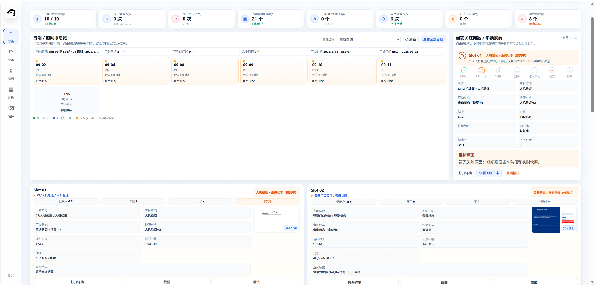
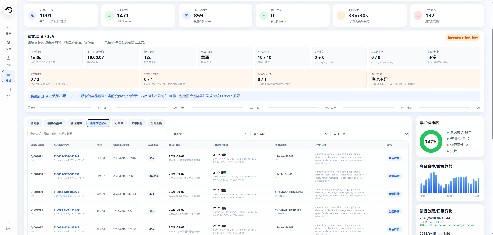
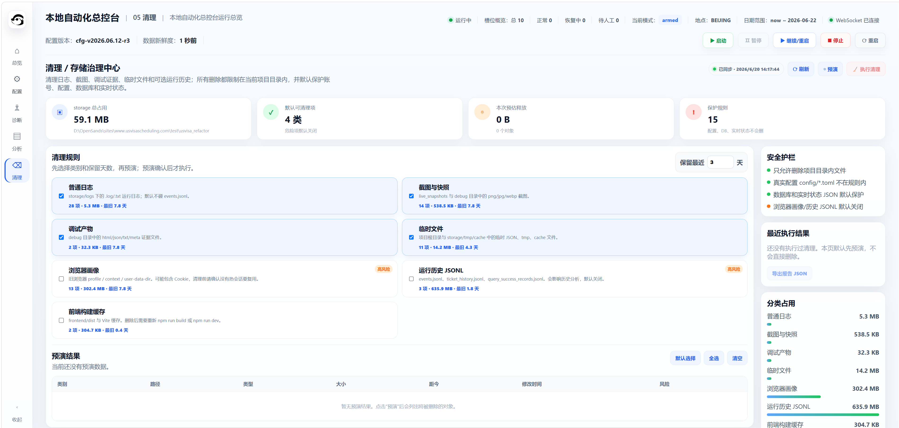
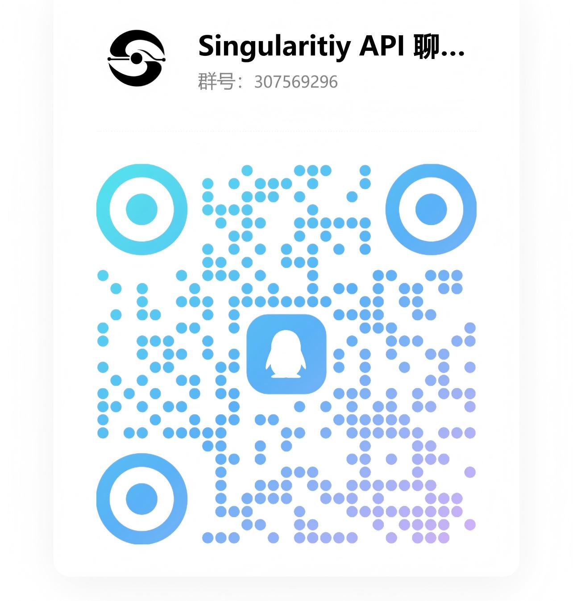

# 美签 US Visa Refactor

<p align="center">
  <a href="https://github.com/Ly-scnu/usvisa_refactor/stargazers"></a>
  
  
  
  
</p>

> 一个面向本地研究、工程化学习和自动化控制台架构交流的重构项目。  
> 一个人长期维护这套系统很累，欢迎 Star、Issue、PR、合作开发、赞助支持，也欢迎自动化、浏览器工程、前端、后端、调度系统方向的大佬指导。
> 如果这个项目对你有帮助，或者给你带来一点启发，欢迎点一个 Star 支持一下；Star 是我继续维护、吸引合作伙伴和争取赞助的重要动力。

<p align="center">
  
</p>

## 项目定位

`usvisa_refactor` 是一个本地自动化调度控制台。它不是零散脚本，而是把浏览器会话、代理路线、页面阶段、业务查询、候选会话、提交策略、日志证据和 UI 诊断统一到一个可观察、可维护、可复盘的工程系统里。

它适合用来研究这些问题：

- 多账号、多代理、多浏览器会话如何被稳定调度。
- CF / Waiting Room / 登录 / 查询 / 提交等阶段如何拆分、诊断和恢复。
- 如何用协议化查询减少无效 UI 跳转，提高查询链路的可控性。
- 如何在高峰窗口前预热候选会话，维护热会话池和健康路线。
- 如何把本地自动化从“脚本能跑”升级成“系统可看、可调、可恢复”。

本项目默认只发布源码、样例配置和 UI 截图；真实账号、代理、Cookie、浏览器 profile、日志、数据库和运行数据不会进入 Git。

## 核心能力

### 1. CF / Waiting Room 阶段治理

- 将 CF、Waiting Room、登录页、业务页等状态拆成明确阶段。
- 支持页面分类、阶段事件记录、失败原因识别、冷却和回收。
- 保留每个 slot 的运行证据，便于复盘“卡在哪一步”。
- 重点是工程化诊断与恢复，不承诺、不宣传、也不授权绕过第三方安全机制。

### 2. 协议化业务查询

- 对目标 post、日期、时间段、查询结果进行结构化封装。
- 支持业务查询链路、日期收集、时间段收集、结果质量判断。
- 尽量减少重复 UI 操作，把查询结果沉淀为可分析的事件和记录。
- 适合研究协议查询、结果聚合、失败分类和查询节流。

### 3. 候选会话与热会话调度

- 多 slot 并行运行，每个 slot 有独立状态、代理、阶段和健康分。
- 支持候选会话、热查询会话、登录备用会话等角色区分。
- 支持高峰窗口、预热窗口、冷却、恢复、库存和路线健康策略。
- 目标是让系统在复杂运行环境下更可控，而不是盲目堆并发。

### 4. 预约提交策略

- 提交能力被单独封装，默认 `booking.armed = false`，避免 clone 后误触发。
- 支持提交超时、并发提交上限、延迟策略、成功锁存和 UI fallback 思路。
- 所有提交相关使用必须由使用者自行确认授权、规则和合规边界。
- 项目不承诺任何预约、抢占、提交或业务结果。

### 5. 代理路线与健康评分

- 支持不同国家/地区、代理类型、ASN 和权重路线配置。
- 记录路线失败、冷却、恢复、风险压力和事件窗口。
- 支持 route score、circuit breaker、route recovery ramp 等调度策略。
- 便于研究“哪条路线更稳定、什么时候该降载、什么时候该恢复”。

### 6. 可视化控制台

- 总览：查看 slot、阶段、代理、健康、目标日期、最近结果。
- 诊断：观察 CF、等待室、登录、查询、提交等阶段状态。
- 票池：分析查询成功记录、路线表现、放票趋势和失败原因。
- 配置：本地编辑目标、账号、代理、并发、冷却和提交策略。
- 清理：预演/执行日志、截图、临时文件、历史 JSONL 清理。

## 界面预览

### 总览 / 实时诊断

<p align="center">
  
</p>

### 配置 / 策略工作台

<p align="center">
  
</p>

### 票池分析 / 运行清理

<p align="center">
  
</p>

## 为什么需要合作

这不是一个简单脚本，而是一个持续迭代的本地自动化系统。一个人维护前端、后端、浏览器链路、调度策略、日志分析、配置安全、测试和文档，时间成本很高。

当前特别欢迎：

- 前端同学：优化 Vue 控制台、图表、交互和响应式体验。
- 后端同学：完善 FastAPI 结构、测试、数据模型和接口边界。
- 浏览器工程同学：一起研究页面状态识别、自动化稳定性和调试工具链。
- 调度系统同学：优化 SLA 编排、候选会话、热会话、路线健康和冷却策略。
- 数据分析同学：把票池、路线、失败原因、查询延迟做成更强的分析面板。
- 安全合规同学：一起完善非商用授权、免责声明和发布边界。
- 投资/赞助朋友：支持服务器、代理、测试环境、开发时间和长期维护。

如果你觉得方向有价值，欢迎 Star、加入群、提 Issue、发 PR，或者直接交流合作。

## 快速开始

```powershell
git clone https://github.com/Ly-scnu/usvisa_refactor.git
cd usvisa_refactor
python -m pip install -r backend\requirements.txt
cd frontend
npm ci
cd ..
powershell -ExecutionPolicy Bypass -File .\scripts\init_config.ps1
powershell -ExecutionPolicy Bypass -File .\scripts\start_all.ps1
```

默认地址：

- API 文档：<http://127.0.0.1:18890/docs>
- Web UI：<http://127.0.0.1:18891>

## 推荐运行流程

1. 运行 `scripts/init_config.ps1` 生成本地配置。
2. 填写自己的账号、代理、目标地点和目标日期。
3. 保持 `booking.armed = false`，先做 dry-run 和链路验证。
4. 打开 UI，检查总览、诊断、票池、配置、清理页面是否正常。
5. 观察每个 slot 的阶段、代理、健康分、最近查询结果和失败原因。
6. 根据自己的合规边界调整调度、冷却、并发和提交策略。
7. 每次运行后先在清理页预演，再清理日志、截图和临时产物。

## 上传前安全检查

```powershell
powershell -ExecutionPolicy Bypass -File .\scripts\check_no_secrets.ps1
git add -n .
```

请不要提交真实配置、`storage/` 运行数据、Cookie、浏览器 profile、日志、数据库、抓包文件和代理凭证。

## 交流与合作

如果你觉得项目有帮助，欢迎给一个 Star。Star 是最直接的支持，也方便后续更新被更多同方向的人看到。

<p align="center">
  
</p>

## 非商用授权

本项目当前仅允许用于个人学习、技术研究、本地实验、代码审阅和非商业交流展示。

未经作者明确书面授权，禁止商业售卖、打包转卖、付费分发、收费 SaaS、代抢、代预约、代运营服务、去除作者信息后重新发布，或将本项目集成到任何商业产品、课程、培训或企业内训。

如需商业使用、课程使用、企业内训、二次发行、项目集成、投资合作或其他超出非商业范围的用途，请先联系作者取得书面授权。

## 免责声明

本项目仅用于工程化学习、自动化系统研究、前端/后端架构交流与本地实验。使用者必须自行确保其行为符合所在国家/地区法律法规、目标网站服务条款以及相关平台规则。

作者不鼓励、不支持、也不授权任何形式的非法用途，包括但不限于未经授权访问、绕过平台规则牟利、破坏服务稳定性、批量滥用账号/代理/接口、侵犯他人权益或传播敏感信息。

本项目不承诺任何预约、查询、提交、抢占或业务结果，不提供任何官方服务，不代表任何政府机构、签证平台、代理服务商或第三方网站。

因使用、修改、分发、部署或参考本项目产生的任何风险、损失、账号问题、服务限制、法律责任或第三方纠纷，均由使用者自行承担。作者和贡献者不承担任何直接或间接责任。

## Star History

如果项目对你有帮助，欢迎 Star 支持，也欢迎加入群交流、提交 Issue、发 PR 或提供合作建议。

<p align="center">
  <a href="https://star-history.com/#Ly-scnu/usvisa_refactor&Date">
    
  </a>
</p>

## 社区鸣谢

本项目认可并感谢 [LINUX DO 社区](https://linux.do/) 提供的开放交流氛围，也欢迎来自 LINUX DO 和其他技术社区的朋友交流、指导、共建。

## 当前状态

- 项目仍在持续重构和迭代。
- README、UI、配置样例、测试和清理中心会继续完善。
- 欢迎有经验的朋友一起把它做成更稳定、更可维护、更专业的本地自动化控制台。
